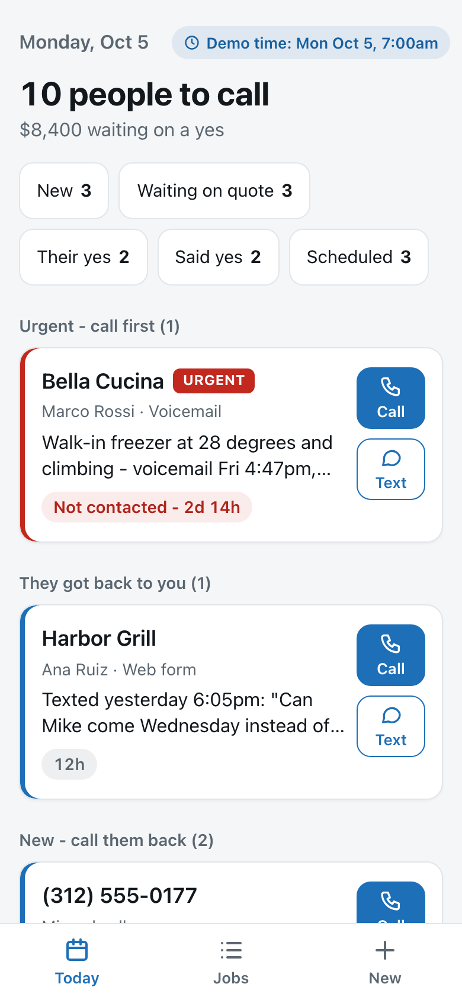
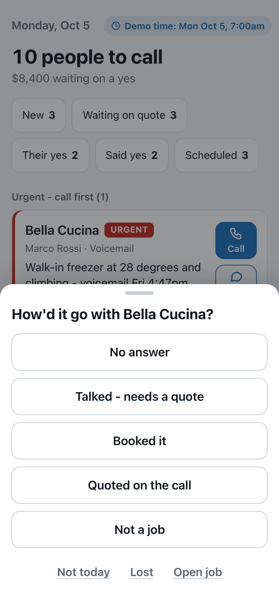
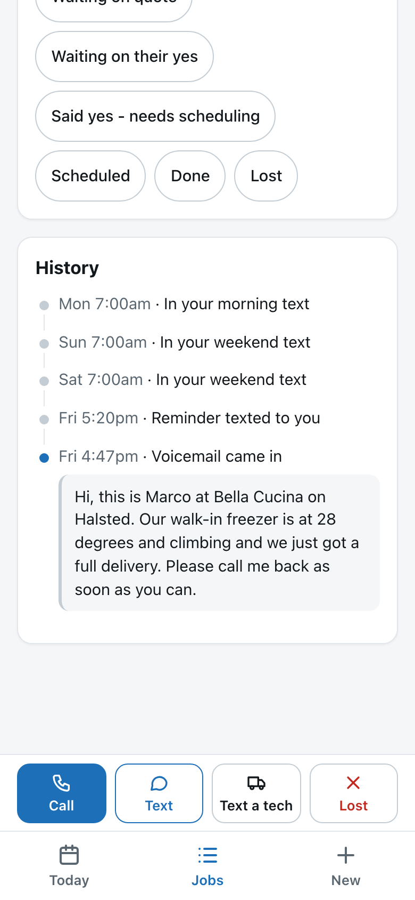

# Callback: who to call today, and where each job is at

*What I'd build for Denise, and the working prototype.*

**In one paragraph.** Denise doesn't need a CRM. She needs a list that can't forget.

- **The list.** Callback is a phone-first web app that works out her morning call list from her jobs. Every open job always has a next date, enforced by the database. Nothing leaves the list until she taps what happened, and that tap sets the next date.
- **Intake.** Requests from her channels land on that same list. The website form arrives automatically. Calls and texts she catches go in with one paste. Texts and missed calls can be fully automatic once a Twilio number is connected; in the prototype they come in through a simulator.
- **To run it:** `npm install && npm start`. No keys and no paid services are needed.
- **AI:** Claude reads messy messages into fields when an API key is set, with guardrails. Without a key, a rule-based parser does the reading.

  
  
  

---

## 1. What I heard

- **The ask:** "I just want to wake up and know who I need to call today… Who to call today, and where each job is at. Waiting on quote, waiting on their yes, scheduled, done. That is it."
- **The cost:** "A restaurant called on a Friday, freezer down, and I forgot to follow up because I was slammed, and by Monday they had called someone else. That is a two thousand dollar job gone."
- **The cause:** "It is not a huge volume, it is just that I drop the ball because it is scattered in five places." Those places are the office line that rings her cell, the website-form inbox, texts from repeat customers and referrals, a notebook, and her memory.
- **A second user:** "My husband keeps asking me for numbers and I cannot even tell him how many open jobs we have."
- **Limits:** "I do not need anything fancy." Tech schedules are "nice later." About 15–20 new jobs a week.

## 2. Diagnosis: two leaks, in order

1. **The follow-up leak (the big one).** She *took* the Friday call. The job died because nothing gave it a next step that would come back after her busy moment passed. A list she has to keep up to date by hand fails exactly when she's slammed, which is when it matters.
2. **The capture leak.** Requests land in five places, and a job only exists if she writes it down.

Fixing the first leak alone would have saved the Friday job. Fixing the second makes the list complete. So the product is built around **a rule, not a board**.

## 3. What I built

**Today (home screen).** One ranked list of who to call and why. The section headings follow her own sentence:

| Section | Example card |
|---|---|
| Urgent - call first | **Bella Cucina** · *Walk-in freezer at 28 degrees and climbing - voicemail Fri 4:47pm, nobody's called back* · **Not contacted - 2d 14h** |
| They got back to you | **Harbor Grill** · *Texted yesterday 6:05pm: "Can Mike come Wednesday instead of Tuesday? We're closed…"* |
| New - call them back | **(312) 555-0177** · *New - missed call Sat 1:12pm - no voicemail* |
| Said yes - needs scheduling | **Joe's Diner** · *Said yes Fri - not scheduled yet - hasn't heard from us in 3 days* |
| Waiting on your quote | **Midway Meats** · *Waiting on your quote since Wed - hasn't heard from us in 5 days* |
| Waiting on their yes - check in | **Rosa's Taqueria** · *Quote sent Thu, $2,400 - no answer in 4 days* |
| Did it get done? | **Sal's Pizza** · *Luis went Fri - done?* |

Every card has **Call** and **Text** buttons that use her own phone, and the text comes pre-written for the situation.

**One tap after the call.**
- "How'd it go?" offers *No answer · Quote sent · They said yes → day → tech · Not today · Lost*.
- **Every answer sets the job's next date for her.** A quote comes back in 2 business days if there's no answer. A visit comes back the next business day as "Did it get done?". "No answer" comes back tomorrow, or in an hour if urgent.
- Each answer can be undone for 6 seconds. It takes at most 3 taps, with no typing.
- When a customer texts "yes go ahead, Thursday works", the card offers **Mark as yes?** with Thursday highlighted. The app suggests and never decides.

**Jobs.** Where every job is, in her stages: *New · Waiting on quote · Waiting on their yes · Said yes - needs scheduling · Scheduled · Done · Lost*. Each stage shows a count, and each job has search and its full history, including every original message word for word.

**Getting jobs in.**

| Channel | In the prototype | To go live |
|---|---|---|
| Calls/texts she catches; her notebook | **Quick Add**: paste or dictate one line and the fields fill in, urgency included. If it's a regular customer with an open job, one tap adds it to that job instead of creating a duplicate. **Brain dump** moves the notebook in one line per job, with stages detected. | Nothing |
| Website form → email | **Real webhook** for Postmark, Mailgun, raw-email or direct form posts. Duplicates are dropped by Message-ID. | One Gmail forwarding rule. Her inbox doesn't change. |
| Texts from customers | Twilio-format SMS adapter. Repeat customers are matched by phone, and replies attach to the open job ("They got back to you"). Texts she forwards from her own phone are unwrapped. | A Twilio number (~$1–2/mo). She forwards texts to a "New Job" contact, and later customers text it directly. |
| Missed calls / voicemail | Twilio-format voice adapter: a missed call or voicemail becomes a job, with the transcript. | Carrier "forward when unanswered" to the Twilio number. No porting, and she can undo it. |

**Texts to Denise.** A 7:00am "who to call" text; a Friday 3pm "before the weekend" text; and one reminder when a new lead sits untouched (30 minutes if urgent, otherwise 2 hours, 7am–9pm only).

**Numbers for her husband.** Open jobs by stage, $ waiting on a yes, won/done/lost, and one leak line: *"Waiting over a day for a first call: 2"*. One button texts it to him, and he can have a read-only link.

## 4. The one rule that stops the leak

- **Every open job always has a next date.** A database CHECK constraint makes "open" and "has a next date" the same thing.
- **Today = every open job whose date has arrived, plus every customer who wrote back.** Overdue items carry forward, and nothing auto-closes.
- **Whose move it is decides the clock:**
  - New leads, emergencies and replies count calendar time, weekends included. That's the Friday story.
  - Chasing a customer's yes waits 2 *business* days, so a Thursday quote comes back Monday instead of nagging on Saturday.
  - Jobs where she owes the next move stay on the list every day until she handles them. After two days the card says "hasn't heard from us in N days", which is her own phrase.
- **"Not today" never hides a leak.** It moves the date but doesn't count as contact.

**The Friday freezer job, replayed.** This is the demo seed, run through the real scheduler:

| When | What happens |
|---|---|
| Fri 4:47pm | Voicemail comes in |
| Fri 5:20pm | Text to Denise: "Still not called back (URGENT): Bella Cucina…" |
| Sat 7:00am, Sun 7:00am | Weekend texts |
| Mon 7:00am | **First card, red, "Not contacted - 2d 14h."** |

## 5. Where AI helps, and where it doesn't

- **Used for one job: reading messy messages** (texts, form emails, voicemail transcripts, pasted lines) into name, business, phone, equipment, problem and urgency.
  - It uses Claude Sonnet (`claude-sonnet-5-5`) with structured outputs. At her volume that costs well under $1 a month, and with no key the app runs on the free rule-based parser.
  - The rule-based parser always runs first, so the job exists immediately. AI only refines it in the background.
- **Guardrails:**
  - A name, phone, email or address from AI is kept only if it appears in the message ("blank beats wrong").
  - AI can raise urgency but never lower it.
  - AI never changes a stage, never sends anything, and never overwrites a field Denise edited.
  - With no key, or on a refusal or error, the rules result stands.
  - The original message is stored before any parsing, so nothing is lost.
- **Deliberately not AI:**
  - Who is on the list and in what order. That has to be explainable, and the reason line *is* the explanation.
  - Due dates and matching customers.
  - Texts to customers. These are templates she sends from her own phone, because her name is on them.

## 6. What I didn't build, and why

| Not built | Why |
|---|---|
| Tech scheduling / dispatch | "That would be nice later but I kind of know where everyone is." A scheduled job holds a date and an optional tech. **Text a tech** sends that tech the job details, which is what she does today. |
| Quotes, invoices, payments | She already quotes her own way. We only record "quote sent" and an optional amount. |
| Automatic texts to customers | Her name is on every message. An auto-reply exists but is **off** until she approves the wording. |
| Dashboards and charts | "Nothing fancy." Her husband's question is answered in one text. |
| Reading her personal texts or Gmail | Not possible on iPhone, and a privacy burden. Forwarding and webhooks cover it. |
| A native app | A web page on her home screen is enough. |

**Why not off-the-shelf** (Jobber, Housecall Pro, ServiceTitan, HubSpot, a Google Sheet)?
- **Field-service suites** solve dispatch and invoicing, which she said she doesn't need. They also assume leads are typed into them. Her leak is *before* that, in five inboxes, and the follow-up rule is the part they leave to her.
- **A CRM or a sheet** is only as current as her data entry, and data entry is the thing that fails on a slammed Friday.
- **What Callback is:** a thin layer that pulls requests from where they already land and refuses to forget them. If she adopts a suite later, Callback can hand jobs to it.

## 7. Making it real: rollout

| When | What happens |
|---|---|
| Day 0 | Deploy (~$5/mo server, HTTPS, passcode). Start Twilio A2P registration, which can take days to weeks. |
| Day 1 (15 minutes with Denise) | Brain dump her notebook and open texts; add Callback to her home screen; put her email in Settings so her own forwards are never taken for a customer. Day one shows her real business. |
| Day 2 | A Gmail filter forwards website-form emails, making the first channel automatic. |
| Week 1 | A Twilio number for texts and a "New Job" contact; "forward when unanswered" for missed calls. |
| Daily | The 7:00am text links straight to Today. Her husband has his read-only link. |

## 8. How we'll know it works (2-week pilot)

- **The Friday metric:** no new lead goes 24 hours without a first contact.
- She opens the list on at least 5 of 7 mornings.
- Outcomes are logged after at least 80% of Call/Text taps, so the list stays true.
- Every open job is in a stage, so "how many open jobs?" always has an answer.
- Her husband stops asking for numbers.

## 9. Risks, and what I'd ask Denise next

- **Habit change on texts** is the biggest adoption risk. That's why paste-into-Quick-Add is the zero-setup default. Longer term, customers text the business number.
- **SMS registration** can take weeks. Until then she uses the home-screen app.
- **Next questions:**
  - What counts as "heard from us"?
  - How fast must a freezer-down call be returned, and should she get texts at night?
  - Does she want an auto-reply, and in what words?
  - Is the office line a separate number, and who is the carrier?
  - Which website form and email does she use?
  - iPhone or Android?
  - How does she find out a job is done?

## 10. How it's built and tested

- **Stack:** Node (built-in SQLite) and Express, with a no-build Preact front end. The rules are pure functions of `(jobs, now, time zone)` in `shared/`, used by both server and browser. Every channel is a thin adapter into one intake pipeline: store raw, dedupe, match customer, then attach or create.
- **Tests:**
  - `npm test` runs unit and integration tests. They assert the exact Monday-morning list, the morning text and the numbers for the demo week, including weekends and daylight-saving changes.
  - `npm run e2e` drives the 3-minute demo in a headless browser.
- **Independent review:** a review of the working build looked at intake integrity, security, the rules, and the UX from Denise's point of view. It turned up real problems, which are all fixed with regression tests. Examples:
  - Website-form notifications all come from one sender address (`no-reply@…`). That merged different customers into one job.
  - A caller who hung up during the voicemail greeting was dropped as an "answered" call.
  - One crafted email could stall the server.
  These are exactly the "lead silently lost" failures this product exists to prevent, so the fixes also guard intake as a whole: the original message is always stored first, and a health check counts unlinked messages, which must stay at zero.
- **Run, demo and deploy:** see the [README](../README.md) and [DEMO.md](DEMO.md).
